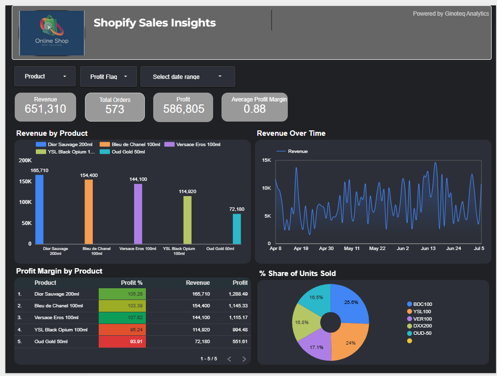

# Shopify Sales Insights Dashboard

This dashboard provides a clear and interactive view of sales performance across various fragrance products sold via Shopify.

## 🔍 Key Metrics Tracked
- **Revenue by Product**
- **Total Orders**
- **Profit & Profit Margins**
- **Revenue Trends Over Time**
- **Units Sold Distribution**
- **Profitability by Product**

## 📊 Visualizations

## 🛠 Tools Used
- **Looker Studio** for dashboard development
- **Shopify Export Data** for source metrics
- **Ginoteq Analytics** for data structuring & insights

---

🔗 Built with love by GinoteqLabs | Transforming raw sales data into actionable insights for small e-commerce sellers.
